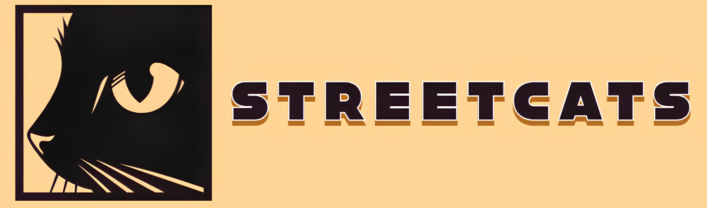

<div align="center">  
  
</div>

<br>

<p align="center">
  <a href="https://www.typescriptlang.org/">
    
  </a>
  <a href="https://developer.mozilla.org/en-US/docs/Web/JavaScript">
    
  </a>
  <a href="https://react.dev/">
    
  </a>
  <a href="https://vitejs.dev/">
    
  </a>
  <a href="https://tailwindcss.com/">
    
  </a>
</p>


# Contents
<p align="center">
  <a href="#project-description">Project Description</a> • 
  <a href="#key-features">Key Features</a> •
  <a href="#how-to-execute">How to execute</a> •
  <a href="#tested-on">Tested on </a> 
</p>

# Project Description
StreetCats is a University project by Federico II, focused on developing a web platform to help regular people spotting stray cats. 
The project aims to create an innovative and user-friendly website.


# Key Features
- **User Authentication & Authorization**
- **Public Discovery & Exploration**:
  - **Interactive Discovery Map**: A central, interactive map displaying all submitted cats as clickable markers.
  - **Detailed Cat Profile Page**: A dedicated profile page for each cat.
- **Community Interaction & Engagement**:
  - **Comments**: users can post and read comments on cat's profile.

# How to execute
The project is built using **ReactTS** and **Vite**. To run it locally, make sure you have **Node.js** and **npm** (or **yarn**/**pnpm**) installed. Then you can follow these steps:
### Frontend
1. Clone the repository
```sh
git clone https://github.com/Sderr12/StreetCats.git
```
2. Navigate into the project folder
```sh
cd ~/StreetCats/frontend/
```
3. Install all dependencies
```sh

# Using npm
npm install

# Using yarn
yarn install

# Using pnpm
pnpm install
```
4. Run the development server
```sh
# Using npm
npm run dev

# Using yarn
yarn run dev

# Using pnpm
pnpm run dev
```
Once the server starts, Vite will display a local development URL (usually http://localhost:5173).
Open it in your browser to view the app.
For a production-ready build, run:
```sh
# Using npm
npm run build

# Using yarn 
yarn run dev

# Using pnpm
pnpm run dev
```
and preview it locally using:
```sh
npm run preview
```
### Backend

# Tested on
<p>
  <a href="https://zen-browser.app/" title="Zen Browser">
    
  </a>
  <a href="https://www.google.com/chrome/" title="Google Chrome">
    
  </a>
  <a href="https://www.apple.com/safari/" title="Safari">
    
  </a>
</p>

<br>
<br>

<div align="right">

  <a href="https://opensource.org/licenses/MIT">
    
  </a>
</div>

